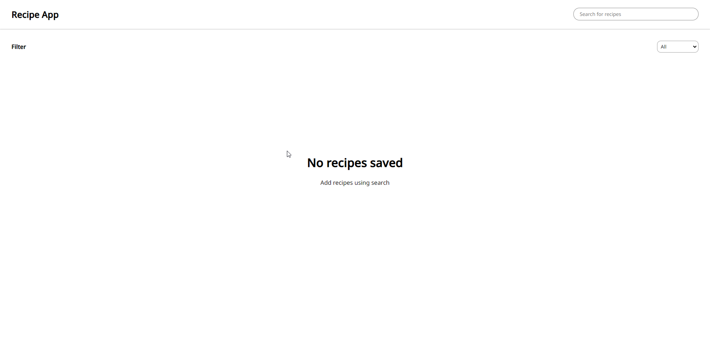
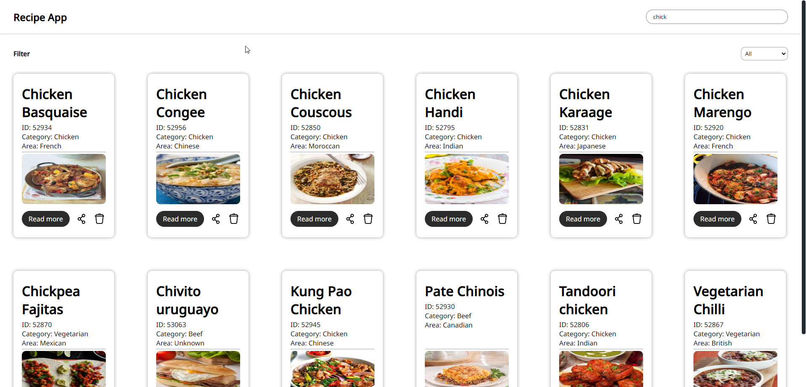
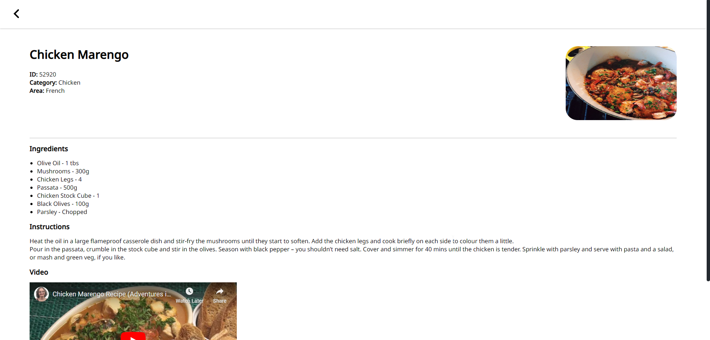

# Recipe App ( Vite + React + Ts)

This is a recipe app used to save and store recipes locally on the system 







## Instruction to run the project 

- First download the project to your local device

- Navigate to the recipe_book folder 

- Install the necessary dependencies by running the command

```
npm i 
```
- Run the project using command 

```
npm run start 
```
- Open your default brower and navigate to this url 

```
https://localhost:5173
```
Please do not claim this project as yours 