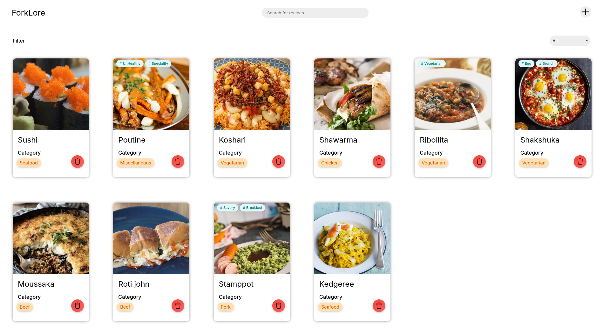
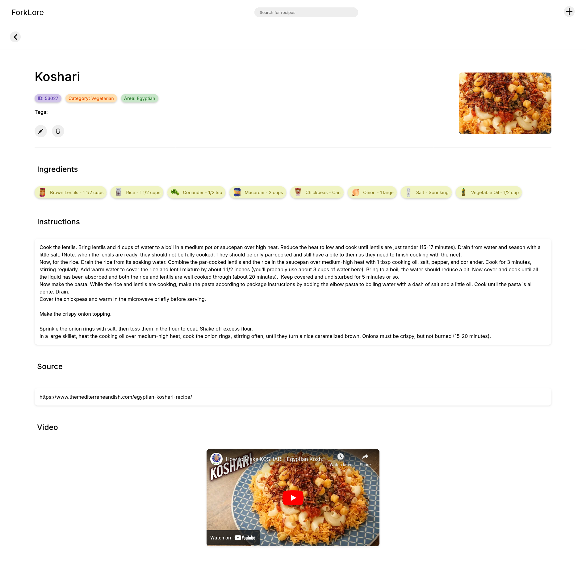
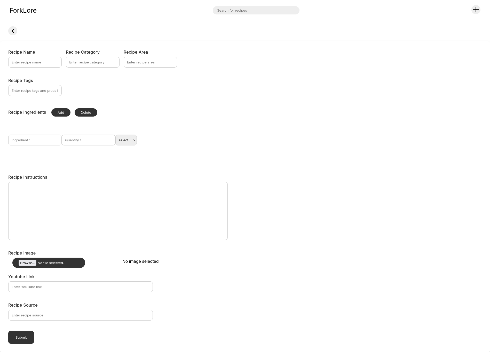
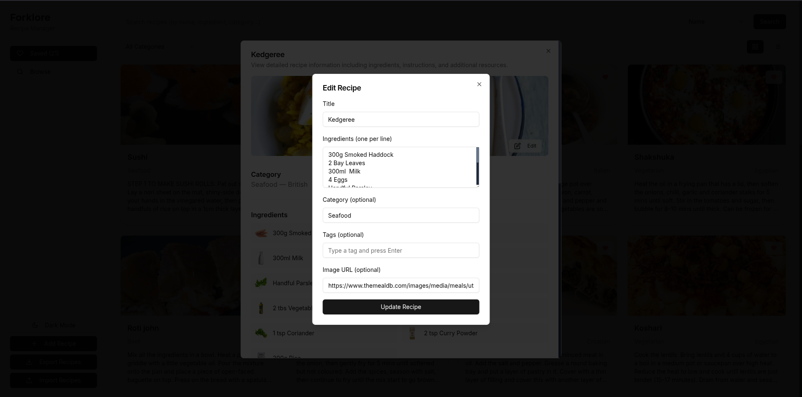

# ForkLore (Vite + React + Ts + Rust + Actix)


This is a recipe app used to save and store recipes locally on the system









## Instruction to run the project

- First download the project to your local device

- Navigate to the forklore folder

- To run the project execute the following command

```
cd client && npm run start-react
```

```
cd server && cargo run
```

- Navigate to the url or ctrl click the url to open in browser from terminal

```
https://localhost:5173
```

## Contributing

- Feel free to fork this repository and submit pull requests.
- Please ensure that all tests pass before submitting a pull request.
- Submit the PR to the test branch

## License

Please do not claim this project as yours.
