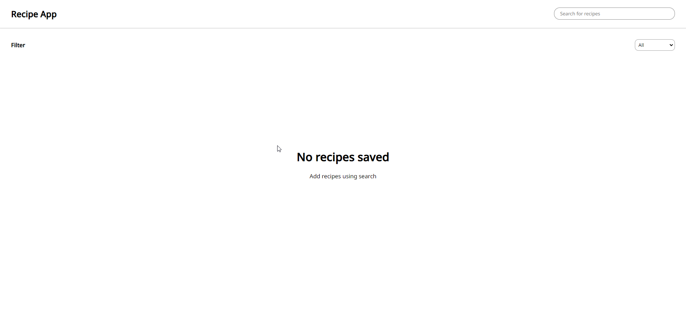
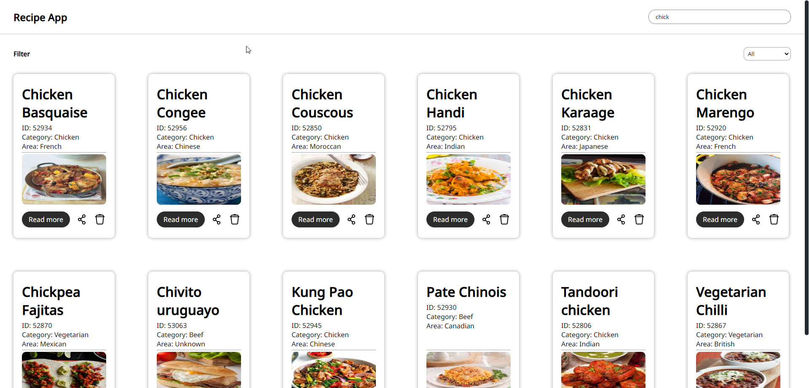
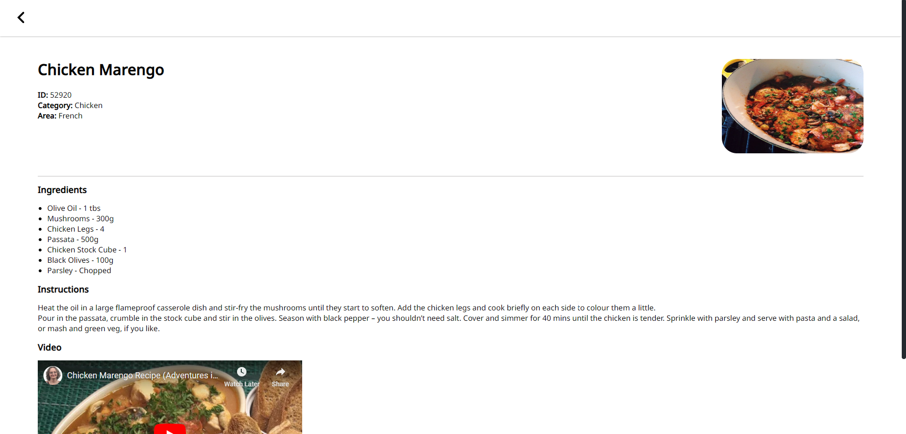
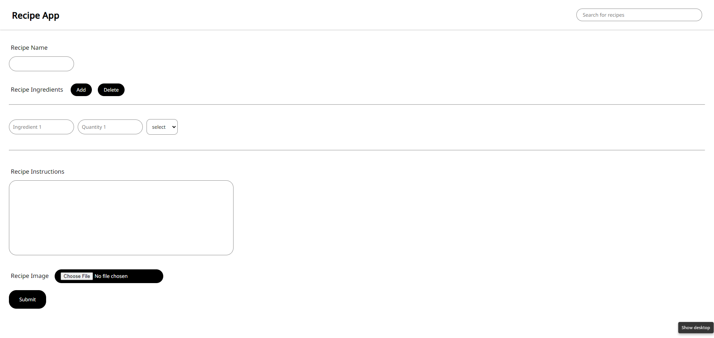

# Recipe App ( Vite + React + Ts)

This is a recipe app used to save and store recipes locally on the system 









## Instruction to run the project 

- First download the project to your local device

- Navigate to the forklore folder 

- To run the project execute the following command
```
node start.js
```
- Navigate to the url or ctrl click the url to open in browser from terminal
```
https://localhost:5173
```
Please do not claim this project as yours 